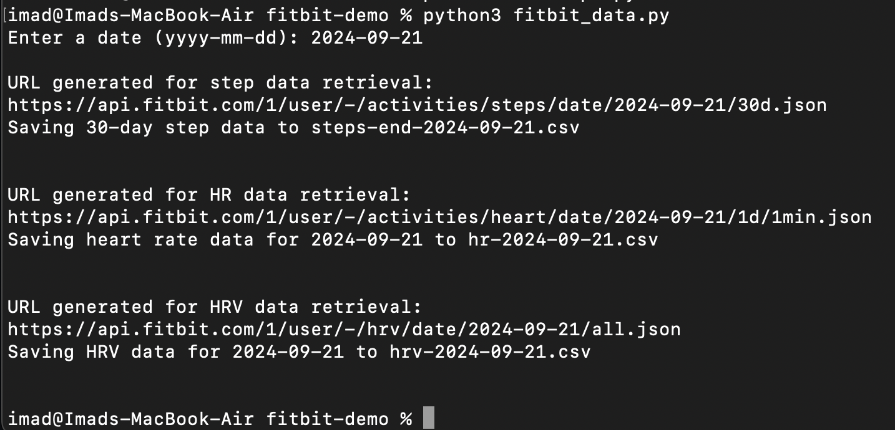
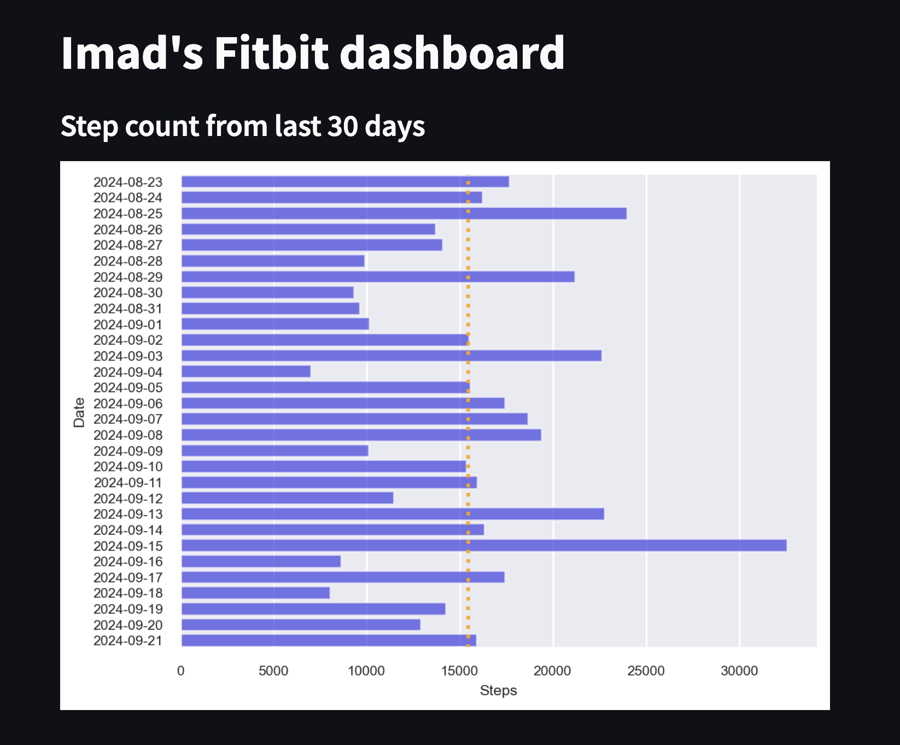
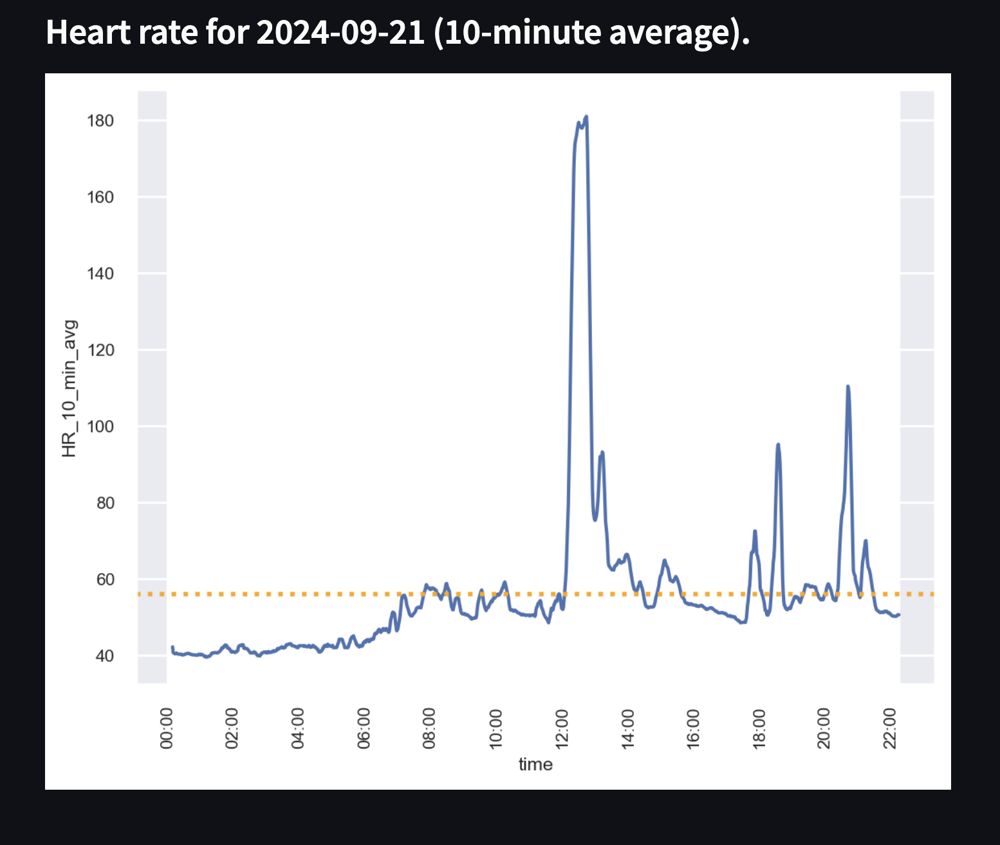

# Fitbit demo applications

## File Descriptions:

**get-access-token.py: ** 
This retrieves an access token required to access Fitbit data programmatically.  To run it, you must have already registered a Fitbit application and obtained a Client ID and Secret.  Modify the appropriate section in the file to input these values.  The access token is valid for 8 hours.  Once expired, you may run the script again to get a new code.  You may also obtain an access code through the web interface:  
https://dev.fitbit.com/build/reference/web-api/troubleshooting-guide/oauth2-tutorial/ 

**steps.py: **
A minimal demo app that illustrates how to retrieve step data for a week.  You must first update the ACCESS_TOKEN variable.  Be sure to use a code editor such as Notepad++ or VS Code.  Built-in plain text editors such as Notepad usually append a .txt file extension, which will cause the Python program to fail (it's expecting a file named .env).  

**fitbit_data.py: **
Set of utility functions (and tests) to retrieve step, HRV, and heart rate data.  Data is saved in csv files and returned as DataFrames.  Requires installation of python-dotenv module (see below).  Fitbit Web API documentation can be found at: https://dev.fitbit.com/build/reference/web-api/

**fitbit_dashboard.py: ** 
Streamlit dashboard application that plots step count for a 30-day period and heartrate for a given day.  Requires installation of streamlit module (see below).

**.env: ** 
This contains an environment defining your access token.  fitbit_data.py reads the access token from this file.  

## How to run the code:
This assumes that you have already followed the instructions linked below and are able to successully run steps.py. The Fitbit API requires Python 3.9.13 or earlier and cherrpy.  Install fitbit and cherrypy as part of a Python virtual environment as detailed in the instructions:

https://docs.google.com/document/d/149YtFyO5k26Z9kgkh6el9sO4TRXkhuSMgwgTZ75BOiA/edit?usp=sharing   

**First, download fitbit_data.py, .env, and fitbit_dashboard to the same folder where you previously stored steps.py.**

### Install Python libraries
In a terminal window, navigate to the project folder where steps.py is stored and activate the Python virtual environment.  Install the following:
* pip3 install python-dotenv   (pip in Windows)
* pip3 install streamlit
* pip3 install matplotlib
* pip3 install seaborn

### Running fitbit_data.py:

&nbsp;&nbsp;&nbsp;**Step 1: ** 
&nbsp;&nbsp;&nbsp;Modify the file .env to include your access token (between quotes).  If your access token is more than 8 hours old, get a new one. 

&nbsp;&nbsp;&nbsp;**Step 2: ** 
&nbsp;&nbsp;&nbsp;Run the program by typing the following command in the same terminal window: python3 fitbit_data.py (python in Windows).  Sample output below.  

### Running fitbit_dashboard.py:

&nbsp;&nbsp;&nbsp;Run the streamlit application by typing the following command in the same terminal window: streamlit run fitbit_dashboard.py.  This should spawn a web application in your browser that retrieves your step and heart rate data.  See screenshots below.  If prompted to input a value in the terminal window, just hit Enter.  To terminate the streamlit application, hit Ctrl-C in the terminal window.  

## Screenshots:

### Output from fitbit_data.py 

